# Добавление CSV-экспорта результатов в Quizzle

**Студент:** Клементьев Алексей Александрович  
**Группа:** 2ом_КЭО/25  
**Дисциплина:** «Управление IT-проектами для корпоративного обучения»  
**Вуз:** РГПУ им. А. И. Герцена  
**Дата выполнения:** 05.10.2026

**Навигация:** [задание](#1-задание-и-результат) · [управление проектом](#2-управление-проектом) · [исходное состояние](#3-исходное-состояние) · [issue](#4-issue-и-критерии-готовности) · [план](#5-планирование) · [ветвление](#6-ветвление-и-история-изменений) · [реализация](#7-реализация) · [проверка](#8-проверка-результата) · [ход работы](#9-ход-работы) · [воспроизведение](#10-воспроизведение).

## 1. Задание и результат

Цель работы — пройти полный цикл небольшой доработки существующего веб-компонента образовательной среды: сформулировать потребность, создать issue, спланировать работу, реализовать функцию в отдельной ветке, проверить результат и оформить его через pull request.

В качестве исходного проекта выбран [Quizzle](https://github.com/gnmyt/Quizzle) — веб-приложение для проведения тестов и тренировочных заданий.

В Quizzle добавлен **CSV-экспорт результатов тренировочных тестов**. Преподаватель может выгрузить каждую сохранённую попытку отдельной строкой и использовать полученный файл для дальнейшей обработки в табличных приложениях.

Управление работой организовано через GitHub Issues, GitHub Projects, Git и Pull Requests.

| Артефакт | Ссылка |
|---|---|
| Исходный проект | [gnmyt/Quizzle](https://github.com/gnmyt/Quizzle) |
| Рабочий форк | [LyoshaGodX/Quizzle](https://github.com/LyoshaGodX/Quizzle) |
| Постановка функции | [Issue #1](https://github.com/LyoshaGodX/Quizzle/issues/1) |
| План этапов | [GitHub Projects](https://github.com/users/LyoshaGodX/projects/1) |
| Ветка разработки | [feature/practice-results-csv](https://github.com/LyoshaGodX/Quizzle/tree/feature/practice-results-csv) |
| Pull request | [PR #9](https://github.com/LyoshaGodX/Quizzle/pull/9) |
| Страница результатов | [Одностраничный сайт](https://lyoshagodx.github.io/quizzle-csv-export-report/) |
| Сценарий выступления | [speech.md](speech.md) |
| Пример CSV | [practice-results_SPEC_2026-10-05.csv](samples/practice-results_SPEC_2026-10-05.csv) |

### 1.1. Соответствие заданию

| Требование | Результат |
|---|---|
| Изучить систему управления IT-проектами | Использованы GitHub Issues, Projects, Git и Pull Requests |
| Выбрать существующий веб-компонент | Выбрана страница результатов practice-теста Quizzle |
| Создать запрос на функциональность | Создана Issue #1 с пользовательским сценарием и критериями |
| Спланировать работу | Подготовлены семь этапов с оценкой 6 часов |
| Использовать стратегию ветвления | Применён GitHub Flow |
| Реализовать функцию | Добавлен CSV-экспорт отдельных попыток |
| Проверить результат | Выполнены автоматические тесты, сборка и проверки выгрузок |
| Оформить отчёт | Подготовлены Markdown-отчёт, доказательства и примеры файлов |
| Подготовить материалы для защиты | Созданы одностраничный сайт и сценарий выступления |

## 2. Управление проектом

Для управления доработкой используется связка:

**GitHub Issues → GitHub Projects → Git → Pull Request**

Issue фиксирует потребность и критерии готовности. Отдельные задачи описывают этапы работы. GitHub Projects показывает их состояние и плановую трудоёмкость. Git сохраняет историю изменений, а Pull Request объединяет реализацию, проверки и итоговый diff.

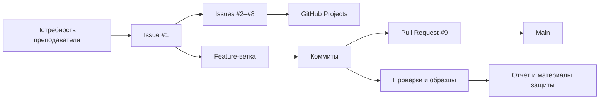

### 2.1. Использованные инструменты

| Элемент | Применение |
|---|---|
| Issue #1 | Описание проблемы, сценария и критериев готовности |
| Issues #2–#8 | Декомпозиция работы на семь этапов |
| GitHub Projects | Статусы и плановая трудоёмкость |
| Git | Ветка и последовательность коммитов |
| Pull Request | Просмотр изменения и слияние |
| Тесты и образцы | Проверка корректности CSV и интерфейса |
| Отчёт | Представление процесса и результата |

В GitHub Projects использованы поля **Title**, **Status** и **План, ч**. Состояния задач проходят последовательность **Todo → In Progress → Done**.

## 3. Исходное состояние

Базой разработки выбран коммит [`c93c5e9`](https://github.com/gnmyt/Quizzle/commit/c93c5e9e0e137171618c51fb82fe5ca04bd92587), соответствующий версии Quizzle 2.6.3.

Для реализации изучены:

- React-страница `PracticeResults`;
- компонент `Button`;
- существующая утилита `ExcelExport`;
- серверный маршрут `/api/practice/:code/results`;
- структура сохранённых попыток;
- схема авторизации и получения результатов.

Основные технологии проекта:

- React 19;
- Vite 8;
- Sass;
- Font Awesome;
- Express;
- Socket.IO;
- Bun;
- SheetJS (`xlsx`).

### 3.1. Компонент до доработки

| Характеристика | Значение |
|---|---|
| Компонент | `PracticeResults` |
| Адрес | `/results/:code` |
| Пользователь | Авторизованный преподаватель |
| Данные | Метаданные теста и сохранённые попытки |
| Исходный экспорт | XLSX |
| Новая функция | CSV отдельных попыток |

До изменения страница результатов содержала кнопку `Als Excel herunterladen`.

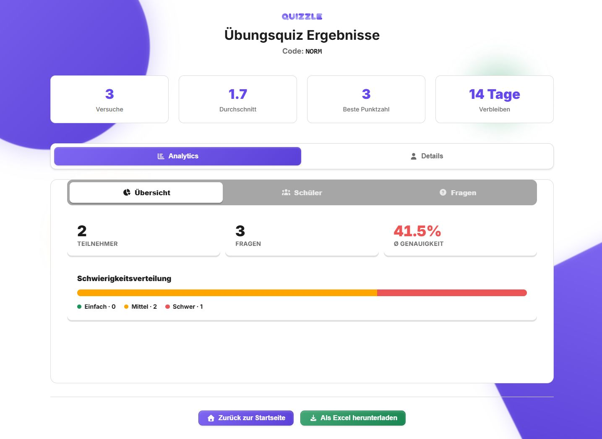

*Рисунок 1. Страница результатов до добавления CSV-экспорта.*

### 3.2. Поток данных

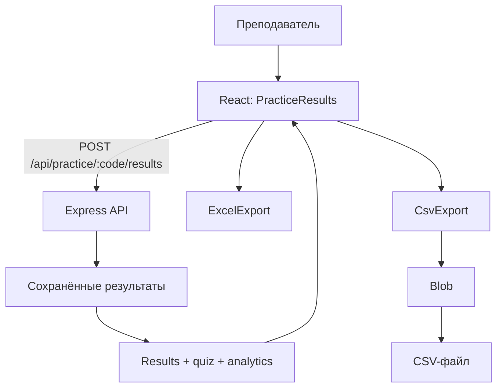

CSV формируется на клиенте из массива результатов, уже полученного страницей.

Каждая попытка сохраняется отдельной строкой. Это позволяет сохранить повторные прохождения одного участника и использовать файл для дальнейшего анализа.

## 4. Issue и критерии готовности

[Issue #1](https://github.com/LyoshaGodX/Quizzle/issues/1) сформулирована до начала реализации.

Пользовательский сценарий:

> Авторизованный преподаватель открывает результаты тренировочного теста, нажимает кнопку CSV-экспорта и получает файл с отдельной строкой для каждой сохранённой попытки.

### Критерии готовности

| Критерий | Реализация |
|---|---|
| Кнопка рядом с Excel | `Als CSV herunterladen` |
| Одна строка на попытку | Повторные прохождения сохраняются отдельно |
| Поля | Practice code, Name, Score, Total, Percentage, Timestamp |
| Процент | Рассчитывается по Score и Total |
| Кодировка | UTF-8 BOM |
| MIME | `text/csv;charset=utf-8` |
| Разделитель | Запятая |
| Строки | CRLF |
| Спецсимволы | RFC-совместимое экранирование |
| Пустой набор | CSV с заголовком |
| Имя файла | `practice-results_<CODE>_<YYYY-MM-DD>.csv` |
| Формулоподобный текст | Защита текстовым префиксом |
| Скачивание | Blob и временная ссылка |
| Существующий XLSX | Сохраняется рядом с CSV |

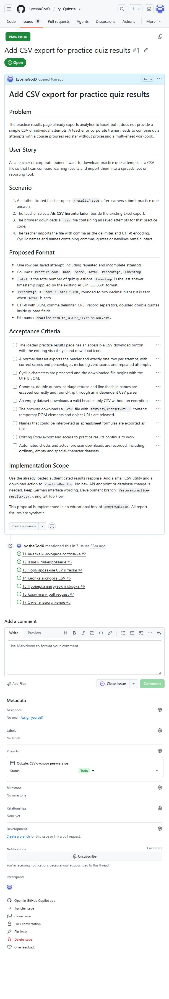

*Рисунок 2. Issue #1 с описанием функции и критериями готовности.*

## 5. Планирование

Работа разделена на семь этапов. Плановая трудоёмкость составляет **6 часов**.

| Этап | Issue | План, ч | Результат |
|---|---|---:|---|
| T1. Анализ исходного состояния | #2 | 0,75 | Базовый коммит, схема данных, снимок интерфейса |
| T2. Issue и планирование | #3 | 0,50 | Критерии функции и GitHub Projects |
| T3. CSV и тесты | #4 | 1,25 | Утилита CSV и автоматические проверки |
| T4. Интеграция кнопки | #5 | 0,75 | CSV-действие в интерфейсе |
| T5. Проверка | #6 | 1,25 | Образцы файлов, сборка, снимки |
| T6. Коммиты и PR | #7 | 0,50 | Pull Request |
| T7. Отчёт и защита | #8 | 1,00 | Отчёт, сайт, сценарий |
| **Итого** | | **6,00** | |

Зависимости этапов:

**T1 → T2 → T3 → T4 → T5 → T6 → T7**

Наиболее трудоёмкими запланированы формирование CSV и проверка результата, поскольку эти этапы напрямую влияют на сохранность и корректность выгружаемых данных.

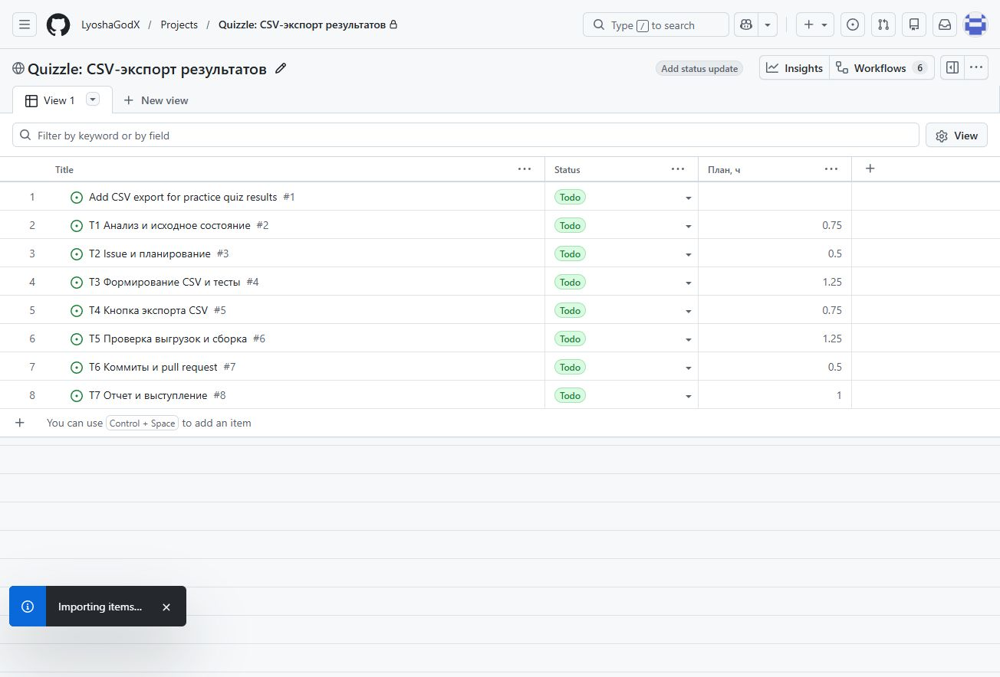

*Рисунок 3. План этапов и оценки трудоёмкости.*

Основные риски, учтённые в плане:

- спецсимволы в CSV;
- кириллица;
- повторные попытки;
- формулоподобные значения;
- пустые выборки;
- адаптация панели кнопок для мобильного экрана;
- регрессия существующего Excel-экспорта.

## 6. Ветвление и история изменений

Для разработки выбран **GitHub Flow**.

Последовательность:

1. создать отдельную feature-ветку;
2. выполнить связанные изменения;
3. сохранить изменения отдельными коммитами;
4. открыть Pull Request;
5. проверить diff и результаты тестов;
6. слить изменения в `main`.

Рабочая ветка:

```text
feature/practice-results-csv
```

Схема истории:

```text
c93c5e9  базовая версия Quizzle
   |
   +-- feature/practice-results-csv
         |
         +-- ada2981  постановка, план, исходное состояние
         +-- 42f53df  CSV-утилита и тесты
         +-- 2494661  кнопка и адаптация панели
         +-- e092daa  образцы выгрузок и проверки
         +-- 34c8508  отчёт и материалы защиты
                 |
                 +-- PR #9
                        |
                        +-- de59c13  merge в main
```

| Коммит | Назначение |
|---|---|
| [ada2981](https://github.com/LyoshaGodX/Quizzle/commit/ada2981) | План и исходное состояние |
| [42f53df](https://github.com/LyoshaGodX/Quizzle/commit/42f53df) | CSV-утилита и 18 тестов |
| [2494661](https://github.com/LyoshaGodX/Quizzle/commit/2494661) | Кнопка экспорта и адаптация панели |
| [e092daa](https://github.com/LyoshaGodX/Quizzle/commit/e092daa) | Образцы файлов и проверки |
| [34c8508](https://github.com/LyoshaGodX/Quizzle/commit/34c8508) | Отчёт и материалы защиты |
| [de59c13](https://github.com/LyoshaGodX/Quizzle/commit/de59c1302c2d8ef7aeb474e3d6f1d978264490f6) | Слияние PR #9 |

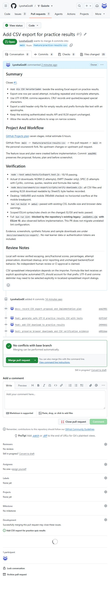

*Рисунок 4. Pull Request #9 с изменением CSV-экспорта.*

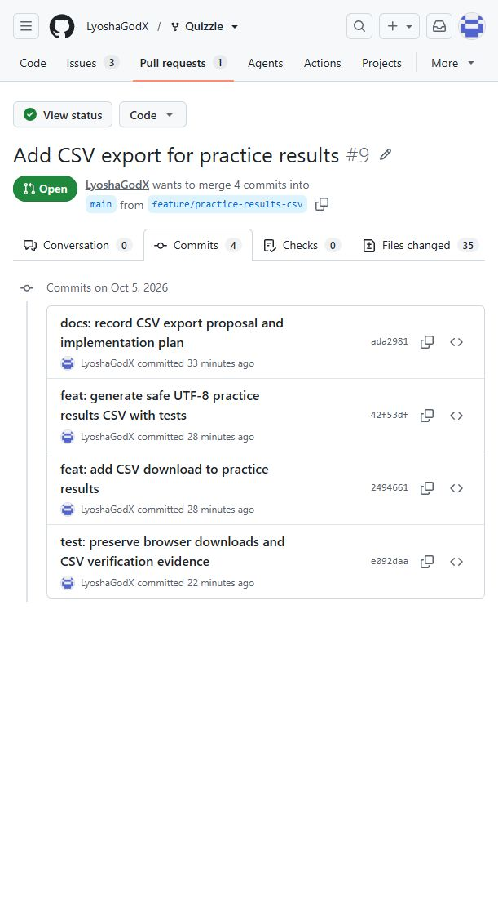

*Рисунок 5. Последовательность коммитов реализации.*

PR #9 связан с основной issue через `Closes #1`. После слияния issue закрылась автоматически.

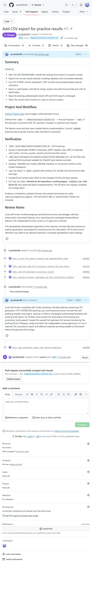

*Рисунок 6. Итоговый статус Pull Request.*

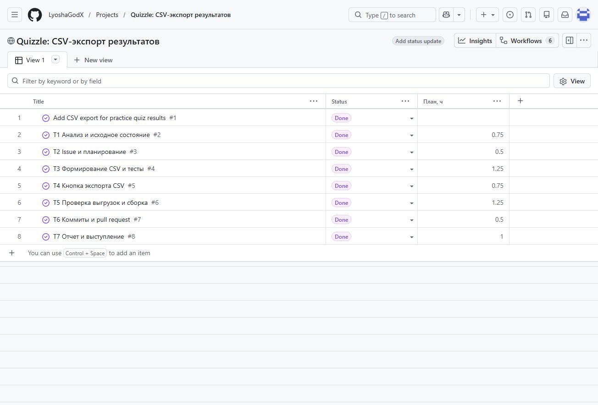

*Рисунок 7. Завершённые этапы проекта.*

## 7. Реализация

### 7.1. Формирование CSV

Добавлена утилита `CsvExport.js`.

Она выполняет две задачи:

- `createPracticeResultsCsv` формирует содержимое CSV;
- `exportPracticeResultsToCsv` инициирует браузерное скачивание.

Каждая сохранённая попытка преобразуется в строку со следующими полями:

```text
Practice code, Name, Score, Total, Percentage, Timestamp
```

Пример:

```csv
Practice code,Name,Score,Total,Percentage,Timestamp
SPEC,Иван Петров,3,3,100,2026-10-05T13:00:00.000Z
SPEC,"Смирнова, Анна",2,3,66.67,2026-10-05T13:00:00.000Z
SPEC,"Олег ""Тест""",1.5,3,50,2026-10-05T13:00:00.000Z
```

Правила экранирования соответствуют CSV-формату:

- поля с запятыми заключаются в кавычки;
- кавычки внутри поля удваиваются;
- перенос строки сохраняется внутри quoted-поля;
- записи разделяются CRLF;
- UTF-8 BOM помогает корректно распознавать кириллицу в Excel.

Для строк, начинающихся с символов формул, используется текстовый префикс.

### 7.2. Интеграция в интерфейс

В `PracticeResults.jsx` добавлены:

- импорт CSV-утилиты;
- обработчик экспорта;
- кнопка `Als CSV herunterladen`;
- сообщения о результате операции.

CSV-кнопка использует существующий компонент `Button`.

В `styles.sass` для панели действий добавлен перенос элементов, чтобы кнопки корректно размещались на узком экране.

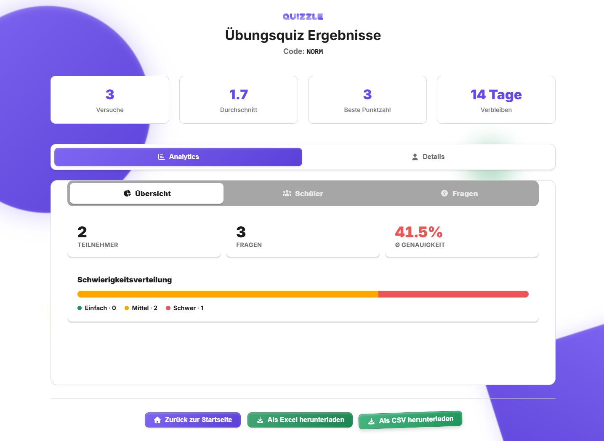

*Рисунок 8. Страница результатов после добавления CSV-экспорта.*

### 7.3. Обработка специальных данных

Отдельный набор `SPEC` содержит:

- кириллицу;
- запятую внутри имени;
- кавычки;
- перенос строки;
- формулоподобное значение;
- дробные баллы.

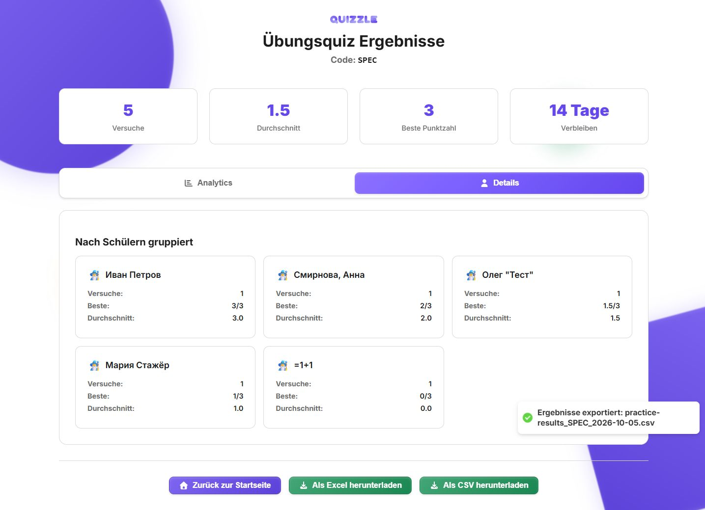

*Рисунок 9. Специальный набор данных.*

Для пустого набора экспортируется корректный CSV с одной строкой заголовков.

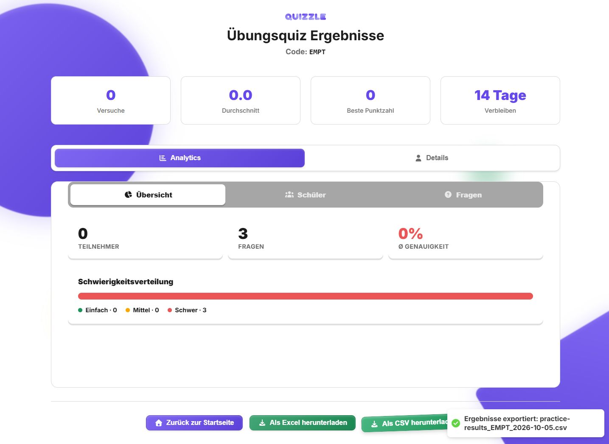

*Рисунок 10. Экспорт пустого набора.*

### 7.4. Мобильный интерфейс

Панель действий проверена на ширине 390 px.

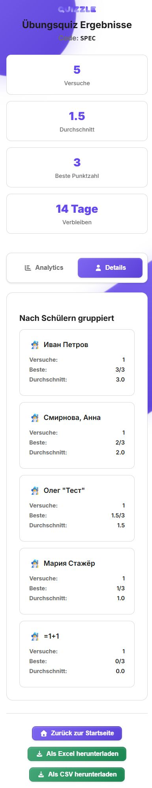

*Рисунок 11. Размещение кнопок на мобильном экране.*

## 8. Проверка результата

Для проверки подготовлены наборы:

- `NORM` — обычные результаты;
- `EMPT` — пустая выборка;
- `SPEC` — специальные символы и граничные случаи.

| Проверка | Результат |
|---|---|
| NORM | 3 строки данных, включая повторные попытки |
| EMPT | Корректный CSV только с заголовком |
| SPEC | Кириллица и специальные символы сохраняют структуру |
| Дробные баллы | Процент рассчитывается корректно |
| Total = 0 | Возвращается корректное значение |
| Формулоподобные имена | Сохраняются как текст |
| Браузерное скачивание | Проверены MIME, имя файла, BOM и освобождение Blob URL |
| Excel-регрессия | Существующий XLSX открывается и содержит 4 листа |
| Мобильный экран | Панель помещается в 390 px |
| Production build | Сборка завершается успешно |

Автоматические проверки:

```text
18 / 18 tests passed
```

Протокол: [unit-tests.txt](evidence/unit-tests.txt).

Сборка сохранена в [build.txt](evidence/build.txt).

Скачанные через интерфейс файлы дополнительно сопоставлены с исходными фикстурами.

Образцы:

- [обычный CSV](samples/practice-results_NORM_2026-10-05.csv);
- [пустой CSV](samples/practice-results_EMPT_2026-10-05.csv);
- [CSV со специальными символами](samples/practice-results_SPEC_2026-10-05.csv);
- [Excel-выгрузка](samples/Übungsquiz_NORM_Analytics_20261005T144513.xlsx).

Фрагмент специальной выгрузки:

```csv
Practice code,Name,Score,Total,Percentage,Timestamp
SPEC,Иван Петров,3,3,100,2026-10-05T13:00:00.000Z
SPEC,"Смирнова, Анна",2,3,66.67,2026-10-05T13:00:00.000Z
SPEC,"Олег ""Тест""",1.5,3,50,2026-10-05T13:00:00.000Z
SPEC,"Мария
Стажёр",1,3,33.33,2026-10-05T13:00:00.000Z
SPEC,'=1+1,0,3,0,2026-10-05T13:00:00.000Z
```

## 9. Ход работы

Работа выполнена в следующей последовательности:

1. Зафиксирована исходная версия Quizzle и изучена страница результатов practice-теста.
2. Определён сценарий CSV-экспорта отдельных попыток.
3. Создана Issue #1 с пользовательским сценарием и критериями готовности.
4. Работа разделена на семь этапов и занесена в GitHub Projects.
5. Создана ветка `feature/practice-results-csv`.
6. Подготовлены тестовые наборы NORM, EMPT и SPEC.
7. Реализовано формирование CSV.
8. Добавлены автоматические тесты.
9. CSV-экспорт встроен в страницу результатов.
10. Панель кнопок адаптирована для мобильного экрана.
11. Через интерфейс скачаны контрольные CSV и XLSX.
12. Выполнены тесты и production-сборка.
13. Создан Pull Request #9.
14. Подготовлены отчёт, сайт и материалы выступления.
15. Pull Request слит в `main`, задачи проекта переведены в Done.

### 9.1. Хронология

| Событие | Дата и время |
|---|---|
| Начало фиксации материалов | 05.10.2026 16:48:29 |
| Issue #1 | 05.10.2026 16:56:58 |
| Задачи T1–T7 | 05.10.2026 17:07–17:10 |
| Коммит плана | 05.10.2026 17:40:35 |
| Коммиты CSV и интерфейса | 05.10.2026 17:45 |
| Проверка файлов | 05.10.2026 17:49:56 |
| Pull Request | 05.10.2026 17:52:35 |
| Материалы защиты | 05.10.2026 18:14:35 |
| Слияние PR | 05.10.2026 18:24:48 |

Плановая оценка проекта составляла **6 часов**. GitHub и Git сохраняют последовательность фактических событий разработки и контрольных точек.

## 10. Воспроизведение

### 10.1. Запуск Quizzle

Проверенная среда:

- Windows;
- Node.js 24.15.0;
- Bun 1.4.2.

```powershell
git clone https://github.com/LyoshaGodX/Quizzle.git
cd Quizzle
git switch feature/practice-results-csv

bun install --frozen-lockfile

Push-Location webui
bun install --frozen-lockfile
Pop-Location

node docs/coursework/csv-export/scripts/seed-demo.cjs
```

Backend:

```powershell
bun server/index.js
```

Frontend:

```powershell
cd webui
bun run dev --host 127.0.0.1 --port 5173
```

После входа доступны контрольные страницы:

```text
/results/NORM
/results/EMPT
/results/SPEC
```

Для скачивания используется кнопка:

```text
Als CSV herunterladen
```

### 10.2. Проверки

```powershell
node --test webui/tests/CsvExport.test.js
node docs/coursework/csv-export/scripts/verify-downloads.cjs
node docs/coursework/csv-export/scripts/verify-lint.cjs

Push-Location webui
bun run build
Pop-Location
```

### 10.3. Проверка материалов отчёта

```powershell
git clone https://github.com/LyoshaGodX/quizzle-csv-export-report.git
cd quizzle-csv-export-report

node scripts/verify-artifacts.cjs
node scripts/verify-downloads.cjs ../Quizzle
node scripts/verify-lint.cjs ../Quizzle
node scripts/verify-published-site.cjs
```

Скрипты проверяют:

- ссылки и изображения;
- контрольные суммы файлов;
- образцы CSV;
- исходные файлы реализации;
- опубликованную страницу отчёта.

## 11. Выводы

В существующий веб-компонент Quizzle добавлена функция выгрузки отдельных попыток тренировочного теста в CSV.

Реализация включает:

- новую кнопку экспорта;
- формирование CSV с UTF-8 BOM;
- корректное экранирование специальных символов;
- сохранение повторных попыток;
- обработку пустой выборки;
- защиту формулоподобного текста;
- адаптацию панели действий для мобильного экрана.

Функция покрыта **18 автоматическими тестами** и проверена на контрольных наборах NORM, EMPT и SPEC. Существующий Excel-экспорт продолжает работать.

Управление доработкой выполнено через GitHub Issues, Projects, feature-ветку и Pull Request. Это обеспечивает связь между постановкой задачи, планом, реализацией, проверками и итоговым изменением кода.

Проект прошёл последовательность:

**постановка задачи → планирование → разработка → тестирование → Pull Request → слияние → оформление результата.**

## 12. Источники

Дата обращения: 05.10.2026.

1. [Quizzle: исходный репозиторий](https://github.com/gnmyt/Quizzle).
2. [MIT License](https://github.com/gnmyt/Quizzle/blob/c93c5e9e0e137171618c51fb82fe5ca04bd92587/LICENSE).
3. [GitHub Docs: About Projects](https://docs.github.com/en/issues/planning-and-tracking-with-projects/learning-about-projects/about-projects).
4. [GitHub Docs: GitHub Flow](https://docs.github.com/en/get-started/using-github/github-flow).
5. [RFC 4180: Common Format and MIME Type for CSV Files](https://www.rfc-editor.org/info/rfc4180/).
6. [Microsoft: Opening UTF-8 CSV files correctly in Excel](https://support.microsoft.com/en-us/office/opening-csv-utf-8-files-correctly-in-excel-8a935af5-3416-4edd-ba7e-3dfd2bc4a032).
7. [OWASP: CSV Injection](https://community.owasp.org/attacks/CSV_Injection).
